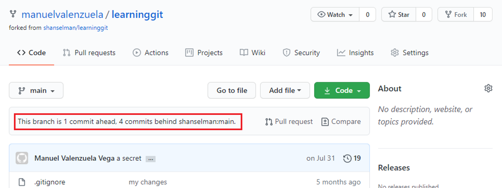
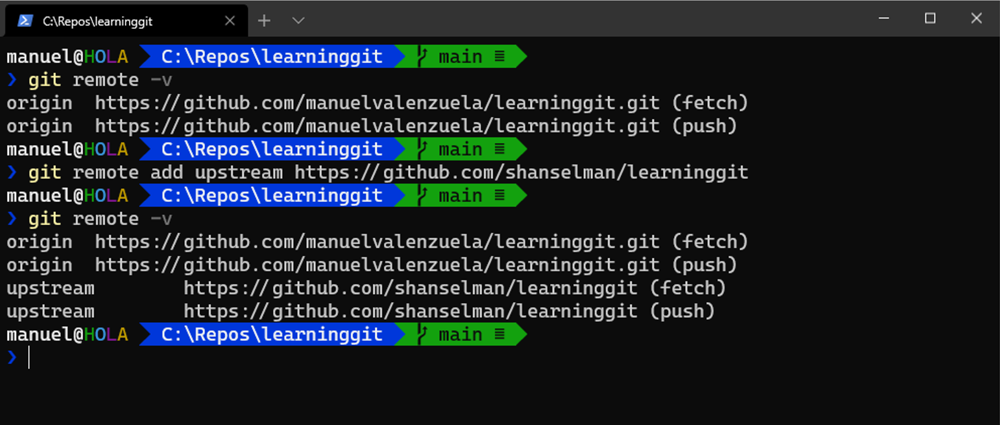
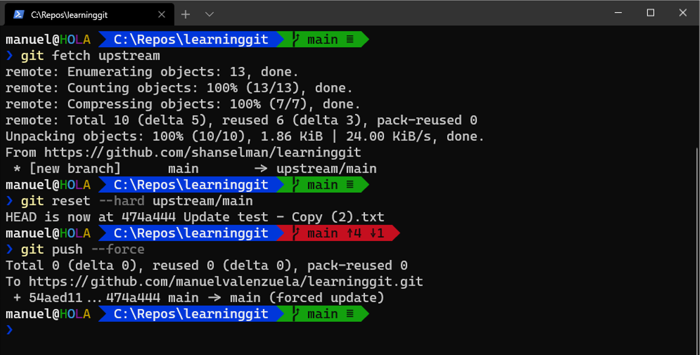
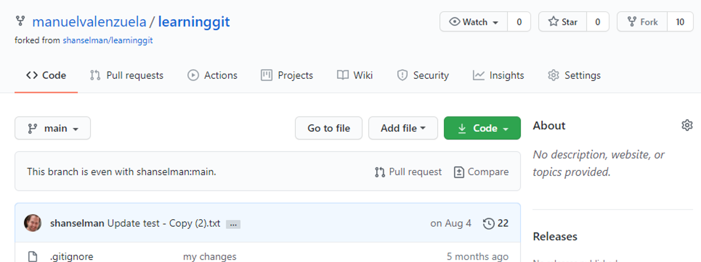

# Git 101 "good practices" for Open Source Software contributions

## Disclaimer
Please consider this as a log of my learning process... So if you have any modification or suggestion on how to do it better, please modify this document! so that we all learn!

## 1. Syncing a Fork

After @shanselman kindly removed the secret I carelessly left in his repository (you can watch him here: [Computer Stuff They Didn't Teach You #7](https://www.youtube.com/watch?v=dgOpnebZkRo&t=5s)), my fork was left in an inconsistent state like this:


So in order to fix it, I had to do a reconciliation between the original repository "shanselman/learninggit" and my forked copy "manuelvalenzuela/learninggit".

First of all I need to know if my repository has the original repository set as remote source, and if not, I have to set it:

```powershell
> git remote add upstream https://github.com/shanselman/learninggit.git
```



After the remote is configured, I can fetch all the changes from the original repo, then reset the actual head of my fork to point to the head of the upstream and finally push that to my fork in github, using the "dangerous" `--force` parameter.

```powershell
> git fetch upstream
> git reset --hard upstream/main
> git push --force
```



Now you can see my fork "is even" with the original repo :sunglasses:

